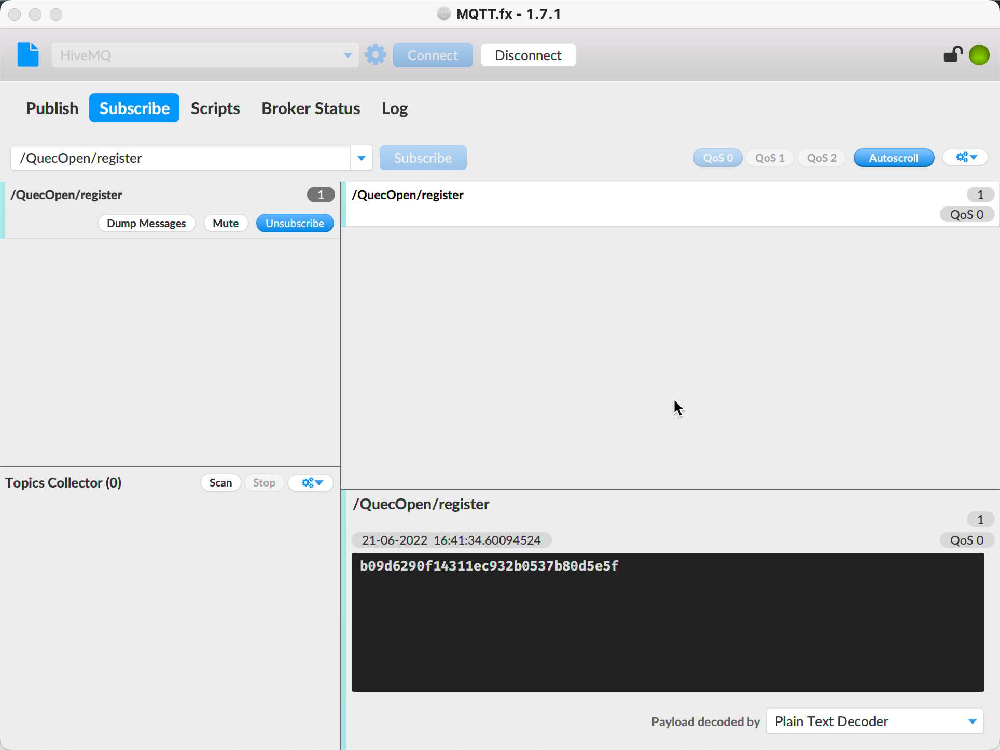

# This is MQTT client example

We can use Public HiveMQ MQTT broker to test:

```
Broker: broker.hivemq.com
TCP Port: 1883
```

## Topic

Let's say once device is on, it will register itself to the topic "/QuecOpen/register" and listen to the topic "/QuecOpen/action" to do action.

We can use `mqttfx` to listen to topic:

